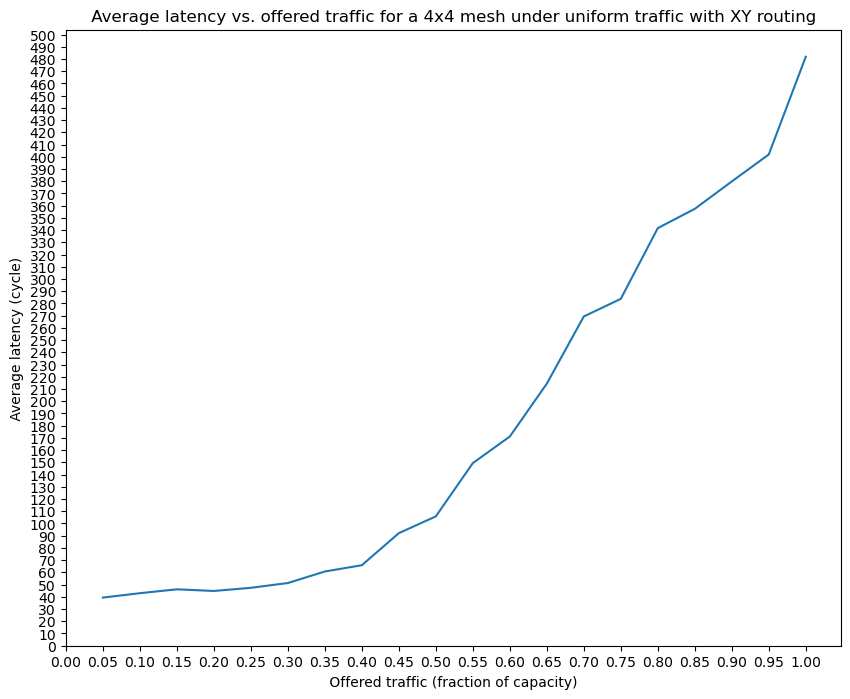

# NoC simulator
Version 1.0

2023/10/30

MRLMRML

This is a cycle accurate simulator for conventional Network-on-Chip (NoC).

## Features

The simulator supports mesh and torus topologies.

It only supports XY-routing algorithm in current version.

Independent and adjustable router numbers in X and Y dimension.

Adjustable flit number per packet.

Adjustable virtual channel number at each input port and also adjustable size of each virtual channel.

Two traffic patterns, uniform random traffic and permutation (all-to-one) traffic, are supported, with periodic injection process.

Injection rate has two mode, packet per cycle and flit per cycle.

The router used in the network is a canonical VC router with best-effort service, i.e., round-robin arbitration policy is adopted.

It has traditional four pipeline stages, Route Computation (RC), Virtual channel Allocation (VA), Switch Allocation (SA), and Switch Traversal (ST).

Each of the stage, as well as the Link Traversal (LT), takes one clock cycle.

In measurement, three phases, warm-up phase, measurement phase, and drain phase are implemented while the cycles for each are adjustable.

For the algorithm details in the router and other critical design choices, please check the figures under directory .\\NoC\\Design

## Performance test

We ran the test with the following parameters:

Topology: Mesh

Dimension: 4x4

Routing algorithm: XY-routing

Virtual channel number: 8

Buffer size: 8

Flit number per packet: 20

Traffic pattern: random uniform

Injection process: periodic process

Injection rate: FLIT_PER_CYCLE

Packets to send: 30

Simulation cycles: 1500

Warm-up cycles: 100

Measurement cycles: 400

Draining cycles: 1000

And the result is shown in figure below:

## To use this simulator

Clone this project and open it in Visual Studio 2022.

**Change the C++ version to C++20.**

Open the file Parameters.h and adjust parameters as you wish.

Then compile and run the program.

The average latency will be printed out in the terminal.

The throughput is not accurate at the moment, please ignore it.

To see the detailed informantion of each packets, open the Data folder.

PacketRecord.csv records all the packets generated and their detailed information.

TrafficData.csv records all the packets measured, i.e., sent in measurement phase.